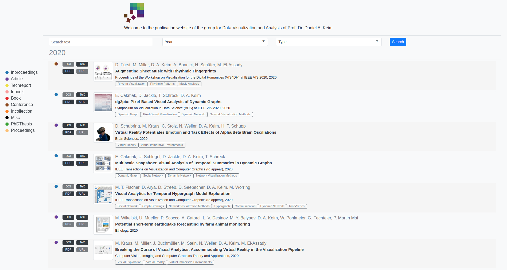

# SciBib

SciBib an online **Sci**entific **Bib**liography System to organize and distribute publications online while having 
full control over the publication system.

See https://bib.dbvis.de for a running instance of SciBib.

See https://webdev.dbvis.de for a website using the JSON API.

#### Features

 * Website to publish publications
 * User-Management
 * Admin-Center (Add/edit/delete publications, authors, keywords, categories)
 * Filter Functionality 
 * Export bibtex support
 * JSON API
 * Responsive Design
 

## Deploy

Click [here](installation.md) for instructions on how to deploy SciBib. 

# Credits

The system was developed with the aid of the following OpenSource libraries and frameworks:

#### Frontend

* [jQuery](https://github.com/jquery/jquery)
* [Bootstrap](https://github.com/twbs/bootstrap)
* [DataTables-Responsive-Bootstrap4](https://github.com/DataTables/Dist-DataTables-Responsive-Bootstrap4)
* [Select2](https://github.com/select2/select2)
* [select2-bootstrap4-theme](https://github.com/ttskch/select2-bootstrap4-theme)
* [SortableJS](https://github.com/SortableJS/Sortable)
* [Font Awesome](https://github.com/onface/font-awesome)
* [Animate.css](https://github.com/animate-css/animate.css)
* [Bibtex](https://github.com/digitalheir/bibtex-js)

#### Backend Python Libs

* [Flask](https://github.com/pallets/flask)
* [Flask-SQLAlchemy](https://github.com/pallets/flask-sqlalchemy)
* [Flask-Security-Too](https://github.com/Flask-Middleware/flask-security)
* [SQLAlchemy-serializer](https://github.com/n0nSmoker/SQLAlchemy-serializer)
* [mysqlclient](https://github.com/PyMySQL/mysqlclient-python)
* [bibtexparser](https://github.com/sciunto-org/python-bibtexparser)
* [Pillow](https://github.com/python-pillow/Pillow)
* [gunicorn](https://github.com/benoitc/gunicorn)

# License

This project is licensed under GNU GPLv3. See the [LICENSE](LICENSE) file for details.

Copyright 2020 [University of Konstanz - Data Analysis and Visualization Group](https://vis.uni-konstanz.de).
